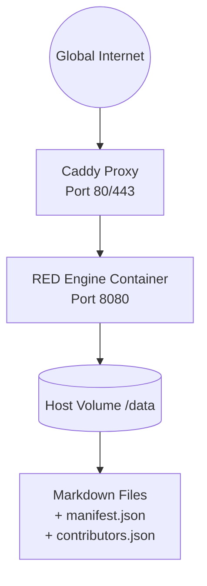

# Project R.E.D.

## Sovereign Knowledge Node Engine

Project R.E.D. rejects both centralized database monopolies and overly complex distributed consensus protocols. Instead, it systematically decouples the **Independent Data Layer** from the **Social Curation Layer**.

The engine operates as a stateless, high‑performance Go runtime that compiles raw Markdown files into visually polarized technical templates, dynamically injecting cryptographic integrity signatures on every request loop.

## 1. The Philosophy: Red Sovereignty

*(The original philosophy remains unchanged – see the “Philosophy” section in the legacy README. In short: no single point of failure, no financial conflict, outsourced curation, no dependency hell.)*

**What’s new:** We added cryptographic **verification badges** and a **SHA‑256 footer** for every article. The engine now also includes a **full‑text search** that indexes all article titles and paths, served via a JSON endpoint and a client‑side JavaScript search bar.

## 2. Current Architecture (Production)

The reference deployment uses **two containers** orchestrated with Podman/Docker Compose:

- **Caddy** – reverse proxy that provides automatic HTTPS (or plain HTTP) and adds security headers.
- **RED Engine** – the Go binary that serves Markdown content, handles verification, search, and admin APIs.




All components run as standard Podman (or Docker) containers, orchestrated via `podman-compose` (or `docker compose`).  
The RED engine listens on port `8080` **internally**, while Caddy exposes ports `80` and `443` to the host.

### Quick Public Access (No DNS required)

For testing, you can expose your local node to the internet using **Cloudflare Tunnel**:

```bash
cloudflared tunnel --url http://localhost:80
```

This gives you a public `https://random-name.trycloudflare.com` URL instantly.

## 3. Development Environment (Hot‑reload, Tailwind CSS)

To contribute to the engine or customise its appearance, you don’t need to rebuild containers for every change. We provide a **local development mode** with live reload.

### Prerequisites

- Go 1.21+
- Node.js (for Tailwind CSS)
- `air` (live reload for Go) – installed automatically by the script

### Getting Started

1. **Clone the repository** and navigate to the project root.
2. Run the development launcher:

```bash
./red-dev          # on Linux / macOS / WSL
.\red-dev.ps1      # on Windows (PowerShell)
```

The script will:
- Install `air` if missing.
- Install Go and npm dependencies.
- Start the **Tailwind CSS watcher** (rebuilds `static/tailwind.css` on changes).
- Start the Go server with `DEV_MODE=true` (serves static files and templates from disk, no rebuild needed).
- Poll until the server responds on `http://localhost:8080`.
- Display both **localhost** and **local network IP** addresses (so you can test on other devices).

**Stop the environment** by pressing `Ctrl+C` – both processes are cleaned up automatically.

### Tailwind CSS Theming

We integrated **Tailwind CSS v3** without overwriting your existing `style.css`. You can gradually add Tailwind utility classes to your templates. The `tailwind.config.js` has `preflight: false` to prevent style resets.

- Input: `internal/router/static/tailwind-input.css`
- Output: `internal/router/static/tailwind.css`

Run the watcher manually:

```bash
npm run watch:tailwind
```

To rebuild once:

```bash
npm run build:tailwind
```

## 4. Cryptographic Verification (Updated)

The verification system now works exactly as described in the legacy README, with two additions:

- The **SHA‑256 hash** of every article is shown at the bottom of the page, allowing readers to manually verify integrity.
- Search results **do not** include unverified articles – they are still listed but shown with the unverified badge.

### `contributors.json` (root of the repository)

```json
[
  {
    "name": "StandardCodebase",
    "public_key": "66f32e250b0bafb2683ae987e65a390901f030ccbc7745435d99f35da1bfccf1"
  }
]
```

### `manifest.json` (inside a vault folder)

```json
{
  "relative/path/to/file.md": {
    "file_hash": "sha256-of-file-content",
    "public_key": "same-as-in-contributors.json",
    "signature": "ed25519-signature-of-the-file-content"
  }
}
```

The verification flow is unchanged – per request, the engine validates hash, signature, and trust list.

## 5. Admin Panel & Content Management

The admin panel (`/-/admin`) now allows you to:

- **Manage trusted contributors** – add/delete public keys with human‑readable names.
- **Sync remote content** from:
  - Raw Markdown files (any HTTP/HTTPS URL)
  - Git repositories (`.git` – supports delta pulls)
  - Tar archives (`.tar.gz`, `.tgz`)
  - Zip archives (`.zip`)
- **List all currently synced sources** (from `config.json`).
- **Remove a source** and optionally delete its local files.
- **Persist sync rules** to `config.json` so they are re‑applied on container start.

The API endpoints are protected by the `adminToken` and use **SSRF protection** (no local/private IPs allowed).

## 6. Installation & Deployment (Updated)

The automatic install scripts (`install-red-engine.sh` / `.ps1`) now also:

- Set correct permissions on the `./data` directory (UID 1000 for container compatibility).
- Generate a strong random `adminToken`.
- Start the containers and display the node URL (`http://localhost`) and admin URL.

### Manual Setup (Docker/Podman)

```bash
git clone https://github.com/RED-Collective/red-engine.git
cd red-engine
podman-compose up --build -d
```

Then visit `http://localhost` and `http://localhost/-/admin` (use the token from `config.json`).

### Managing the Admin Token

```bash
# Linux/macOS
./manage-token.sh

# Windows
.\manage-token.ps1
```

After changing the token, restart the container:

```bash
podman-compose restart red_engine
```

## 7. Simulating Knowledge Base Structures

*(Unchanged – uses native filesystem directories. See original README.)*

## 8. Search & User Interface

- **Client‑side search** – the input in the navbar fetches `/-/search-index.json` and dynamically displays matching articles.
- **Breadcrumbs** – automatically generated from the URL path.
- **Responsive sidebar** – collapses on mobile (with optional hamburger menu, not yet implemented).

### Theming direction (planned)

We are actively designing a **Roman‑inspired** theme (marble textures, gold accents, classical paintings) while keeping the w3schools‑like layout. The new Tailwind CSS pipeline will be used to implement this theme incrementally, without breaking existing functionality.

## 9. Development Script (`red-dev`) Details

The script is located at the project root and is self‑contained. It:

- Checks for `go`, `npm`, and installs `air` if missing.
- Runs `go mod download` and `npm install` when needed.
- Launches Tailwind watcher in background.
- Launches `air` with `DEV_MODE=true` in background.
- Polls `http://localhost:8080` until ready.
- Prints URLs including the local network IP (useful for testing on phones / other computers).

**Output example:**

```
🚀 Starting RED Engine development environment...
📦 Installing Go dependencies...
🎨 Starting Tailwind CSS watcher...
🏃 Starting Go server with live reload (DEV_MODE=true)...
Waiting for server to start... ✓

✅ RED Engine is running!
   📡 Local:    http://localhost:8080
   🌐 Network:  http://192.168.1.100:8080

   Press Ctrl+C to stop.
```

## 10. Technical Stack Summary

- **Language & Runtime:** Go 1.21+
- **Markdown Parser:** `goldmark`
- **HTML Sanitizer:** `bluemonday`
- **Reverse Proxy:** Caddy (automatic HTTPS)
- **Container:** Podman / Docker, multi‑stage Alpine build
- **Frontend Tooling:** Tailwind CSS v3 (optional, for theming)
- **Live Reload:** `air` (development only)
- **Public Access:** Cloudflare Tunnel (quick testing)

## 11. Roadmap (Short‑Term)

- [x] Cryptographic verification badges
- [x] Full‑text search
- [x] Admin panel with contributor management
- [x] Sync from Git / tar / zip / raw URLs
- [x] Local development environment with hot‑reload and Tailwind
- [ ] Roman‑inspired UI theme (marble, gold, classical paintings)
- [ ] Mobile sidebar toggle
- [ ] Fuzzy search (fuse.js)
- [ ] User‑friendly error pages (404, 500)

## 12. Conclusion

Project R.E.D. is no longer just a concept – it is a **working, deployable, and extensible node engine**. You can run your own sovereign knowledge node, import content from anywhere, verify cryptographic signatures, and search everything instantly. The development workflow is modern and efficient, encouraging contributions and custom theming.

**Claim Your Agency. Run a Node.**
